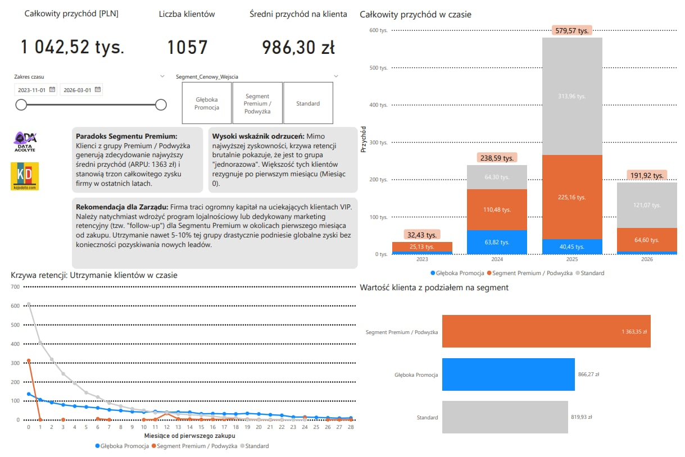
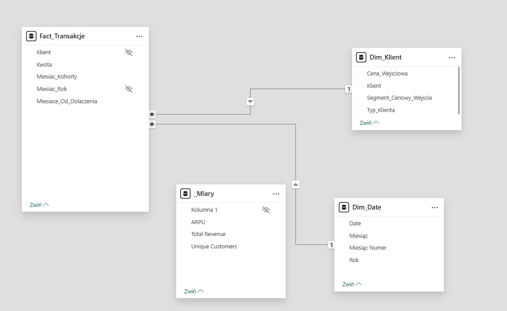

# Customer Retention & Pricing Strategy Analysis ("The Premium Paradox")

## Project Overview
This project evaluates a transactional subscription dataset (~4,000 records) to determine how promotional pricing, standard rates, and price increases impact customer retention, long-term LTV, and churn rates. Created as part of the **KajoData** and **Data Acolyte** data analysis challenge.

### Key Business Questions Addressed
* How do pricing changes directly affect the influx and quality of new customer cohorts?
* Are high-value customers churning faster depending on their price tier?
* What is the optimal strategic balance between promotional acquisition and retaining price-increased tiers?

---

## Key Business Findings & Strategic Impact

Through cohort breakdown and time-series retention tracking, three core customer behaviors were identified:

| Pricing Segment | Key Metric (ARPU) | Retention Profile | Operational Impact & Finding |
| :--- | :--- | :--- | :--- |
| **Premium / Price Increase** | **1,363 PLN** (Highest) | **Critical Churn (Month 1)** | **"The Premium Segment Paradox":** Generates the highest immediate revenue, but customers treat it as a "one-off" service and churn immediately after Month 0/1. |
| **Promotional Pricing** | Lower ARPU | High Acquisition / Low Loyalty | Attracts high transaction volume, but users show low long-term retention without follow-up incentives. |
| **Standard Rates** | Baseline ARPU | Steady / Predictable | Provides steady, recurring baseline revenue with moderate retention curves. |

---

## Actionable Strategic Recommendation

The data explicitly reveals that the company suffers substantial revenue leakage due to the rapid churn of VIP customers in their first month.

> **Executive Recommendation:**  
> Shift marketing focus from aggressive discount-led acquisition to an automated **Month 1 VIP Loyalty & Onboarding Program** targeting the Premium tier. Retaining even **5–10%** of this specific cohort will significantly increase global net profits without raising Customer Acquisition Costs (CAC).

---

## Tools & Technical Implementation

* **Data Modeling (Power Query):** Refactored a flat transactional file into a highly optimized **Star Schema**. Separated data into `Fact_Transactions`, `Dim_Customer`, and a dynamically generated `Dim_Date` table to ensure scalable performance and correct filter propagation.
* **DAX Optimization:** All calculations (ARPU, Active Subscribers, Retention %, Cumulative Revenue) are encapsulated in a dedicated measure table to maintain a clean evaluation context.
* **Power BI:** Built an executive dashboard focused on data-to-ink ratio, highlighting key actionable metrics over decorative visuals.

---

## Dashboard & Architecture Preview

### 1. Executive Dashboard

  

### 2. Relational Data Model (Star Schema)

  
   
  <em>Data architecture refactored from a flat file to a dimensional model.</em>

---

## Dataset Specification
* **Timeframe:** November 2023 – March 2026
* **Volume:** ~4,000 transactional records
* **Core Dimensions:** `Transaction Date`, `Customer ID`, `Amount`, `Pricing Tier`
